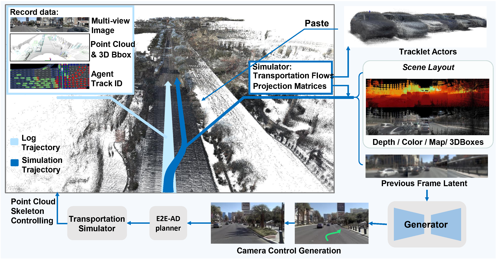

# Point as Skeleton

**Point as Skeleton (PAS)** is a closed-loop generative driving simulation codebase for autonomous driving research. It augments an autoregressive driving-world generator with accumulated point-cloud skeletons, so that generated camera observations can follow simulator-updated ego poses and actor states at each step.

<p align="center">
  <!-- Recommended: use the paper's full simulator overview figure here. -->
  
</p>

<p align="center">
  
</p>

## Highlights

- **Closed-loop generative simulation**: generates camera observations from simulator-updated states during frame-wise re-plan.
- **Point-as-skeleton conditioning**: uses accumulated background point clouds and foreground actor assets as editable scene skeletons.
- **nuPlan scene interface**: provides both original DB-trajectory replay and user-controlled trajectory generation.

## Code structure

This repository contains two main components.

| Component | Path | Purpose |
| --- | --- | --- |
| DWM / PAS generation stack | [`src/dwm`](src/dwm/README.md) | Training, data loading, point-cloud conditioning, and preview generation for nuScenes and nuPlan. |
| nuPlan scene interface | [`nuplan`](nuplan/README.md) | A closed-loop scene interface that connects a trained PAS generator with nuPlan DB replay or user-defined trajectories. |

The root README gives only the high-level structure. Please refer to each module README for setup and usage details.


## Training overview

For **nuScenes**, PAS training can start directly from the OpenDWM checkpoint.

```text
OpenDWM checkpoint
  -> nuScenes PAS training
  -> nuScenes long-horizon generation / evaluation
```

For **nuPlan**, we recommend adapting the generator to nuPlan before point-cloud-conditioned PAS training.

```text
OpenDWM checkpoint
  -> nuPlan SFT
  -> nuPlan PAS training
  -> nuPlan closed-loop simulation
```

The main config templates are:

| Stage | Config |
| --- | --- |
| nuScenes PAS training | `configs/pas/nus/pas_train.json` |
| nuScenes long-horizon generation | `configs/pas/nus/pas_long.json` |
| nuPlan SFT from OpenDWM | `configs/pas/nuplan/nuplan-dwm.json` |
| nuPlan PAS from nuPlan SFT | `configs/pas/nuplan/nuplan-pas.json` |

## Data, assets, and checkpoints

Data preparation can follow the implementations in [src/dwm/datasets](src/dwm/datasets), and configuration examples could reference [configs](https://github.com/SenseTime-FVG/OpenDWM/tree/main/configs).
PAS also requires point-cloud skeleton assets. These assets can be prepared in two ways:

1. Generate them from raw datasets using the tools under [`src/dwm/tools/data_tools`](src/dwm/tools/data_tools).
2. Download the preprocessed assets provided below.

| Asset | Description | Link |
| --- | --- | --- |
| nuScenes foreground / background point-cloud assets | Point-cloud skeleton assets for nuScenes PAS training and generation | [Download](https://pan.baidu.com/s/1ZS4iYvlA9_99peCs_iNssA?pwd=4930) |
| nuPlan background point cloud | Background scene point cloud for the example nuPlan scene `2021.05.12.22.28.35_veh-35_00620_01164` | [Download](https://pan.baidu.com/s/13dkOwreppg0u8mNyV6POZg?pwd=4930) |
| nuPlan foreground actor assets | Actor-level point-cloud assets and templates for nuPlan simulation | [Download](https://pan.baidu.com/s/1p45vjTZ2HnbpI-lScuZCew?pwd=4930) |

The default initialization uses the following public checkpoints:

| Checkpoint | Description | Link |
| --- | --- | --- |
| Stable Diffusion 3.5 Medium | Base diffusion model | [Hugging Face](https://huggingface.co/stabilityai/stable-diffusion-3.5-medium) |
| OpenDWM checkpoint | Initial DWM checkpoint used for PAS training | [Hugging Face](https://huggingface.co/wzhgba/opendwm-models/resolve/main/ctsd_35_df16_tirda_bm_nwao_40k.pth?download=true) |
| nuPlan SFT checkpoint | nuPlan-adapted checkpoint before PAS point-cloud training | [Download](https://pan.baidu.com/s/108mctkWJDfNqz6BbOeJsJQ?pwd=4930) |
| nuPlan PAS checkpoint | nuPlan checkpoint trained with PAS point-cloud conditioning | [Download](https://pan.baidu.com/s/168k-Jv2YgvjiaOIHOA_y7g?pwd=4930) |
| nuScenes PAS checkpoint | Final nuScenes PAS checkpoint | [Download](https://pan.baidu.com/s/14AK4gyR2spohirET7yw9mA?pwd=4930) |

All paths in the config files are templates. Please update dataset paths, point-cloud asset paths, annotation paths, and checkpoint paths according to your local environment before running training or inference.

<p align="center">
  
</p>

## Acknowledgements

This repository builds on several open-source projects:

- [OpenDWM](https://github.com/SenseTime-FVG/OpenDWM)
- [MMCV](https://github.com/open-mmlab/mmcv)
- [nuPlan devkit](https://github.com/motional/nuplan-devkit)

We thank the authors and contributors of these projects.
